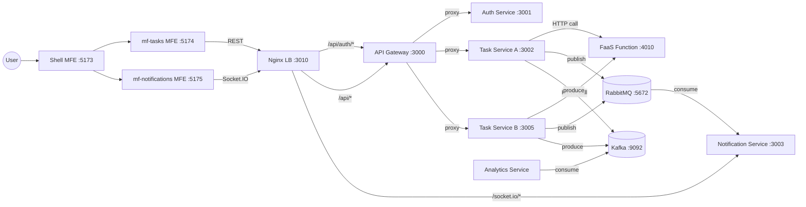
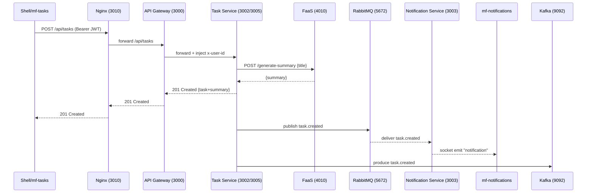
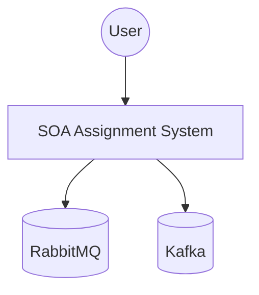

# SOA Assignment

## Microservices + Nginx LB + RabbitMQ + Kafka + FaaS + Micro-frontends

This repository contains a distributed system implementing:

- **Secured REST** (Auth service issues JWT)
- **API Gateway** (JWT verification, forwards user id downstream)
- **Task Service** (REST API, load-balanced via Nginx)
- **Notification Service** (Socket.IO notifications)
- **RabbitMQ** (message broker)
- **Kafka** (event streaming)
- **FaaS function service** (HTTP “function” used by Task Service)
- **Micro-frontend UI** (Shell + Tasks widget + Notifications widget)

---

## Architecture

### Client access

The client (Shell micro-frontend) calls:

- REST via Nginx: `http://localhost:3010/api/...`
- Socket.IO via Nginx: `http://localhost:3010/socket.io/`

Nginx load-balances **Task Service** instances and proxies **Socket.IO** to the **Notification Service**.

### Architecture overview

This diagram shows how the micro-frontends, Nginx load balancer, backend services, and messaging/eventing components interact.



---

## Sequence

### Create task → FaaS → RabbitMQ/Kafka → Notifications

This sequence shows the main user flow: creating a task calls a FaaS function to generate a summary, then emits events to RabbitMQ and Kafka, and finally notifies the UI via Socket.IO.



---

## C4 Models

The C4 model is a lightweight architecture documentation method with multiple levels:

- **Level 1 (System Context)**: system as a black box + external dependencies
- **Level 2 (Containers)**: deployable units/services and how they interact

### C4 Level 1 — System Context

Shows the system as a black box and the main external dependencies.



### C4 Level 2 — Containers

Shows the main deployable units (frontends, gateway, services, infra).

```mermaid
flowchart LR
  user((User)) --> shell[Web App (Micro-frontends)]
  shell --> nginx[Nginx LB :3010]

  nginx --> gw[API Gateway :3000]
  gw --> auth[Auth Service :3001]
  gw --> tasks[Task Service (scaled) :3002/:3005]

  nginx --> notif[Notification Service (Socket.IO) :3003]

  tasks --> rabbit[(RabbitMQ)]
  tasks --> kafka[(Kafka)]
  tasks --> faas[FaaS Function :4010]

  kafka --> analytics[Analytics Service]
```

---

## Prerequisites

- **Node.js** (v18+ recommended; works with newer versions)
- **Docker Desktop** (for RabbitMQ/Kafka and optionally Nginx)
- **npm**

---

## Ports

### Reverse proxy / Load balancer

| Component | Port |
|---|---:|
| Nginx LB | `3010` |

### Backend

| Component | Port |
|---|---:|
| API Gateway | `3000` |
| Auth Service | `3001` |
| Task Service (instance A) | `3002` |
| Task Service (instance B) | `3005` |
| Notification Service (Socket.IO) | `3003` |
| FaaS Function Service | `4010` |

### Messaging / Streaming

| Component | Port(s) |
|---|---:|
| RabbitMQ (AMQP) | `5672` |
| RabbitMQ UI | `15672` |
| Kafka | `9092` |
| Zookeeper | `2181` |

### Frontend (micro-frontends)

| Component | Port |
|---|---:|
| Shell MFE | `5173` |
| mf-tasks | `5174` |
| mf-notifications | `5175` |

---

## Run (dev)

Open multiple terminals and start each service.

### 1) Infrastructure

Start RabbitMQ + Kafka (and any other infra you have compose for).

RabbitMQ UI:

- `http://localhost:15672` (guest/guest)

### 2) Backend services

In separate terminals:

**Auth service**
```bash
cd auth-service && npm start
```

**API Gateway**
```bash
cd api-gateway && npm start
```

**Task service (A)**
```bash
cd task-service && npm start
```

**Task service (B)**
```bash
cd task-service && PORT=3005 INSTANCE_ID=B npm start
```

**Notification service**
```bash
cd notification-service && npm start
```

**FaaS function**
```bash
cd faas-function && npm start
```

### 3) Nginx

Use `nginx.conf` from this repository to run the load balancer on port **3010**.

### 4) Frontend (micro-frontends)

In separate terminals:

```bash
cd shell && npm run dev
```

```bash
cd mf-tasks && npm run dev
```

```bash
cd mf-notifications && npm run dev
```

Open:

- `http://localhost:5173`

---

## Quick verification (proof for grading)

### RabbitMQ evidence

- Queue `task_events` shows publish/deliver/ack.

Optional API checks:

```bash
curl -u guest:guest http://localhost:15672/api/queues/%2F
```

```bash
curl -u guest:guest http://localhost:15672/api/connections
```

### Kafka evidence

- Topic `task-events` contains JSON events like `task.created`.

List topics:

```bash
docker exec -it project-kafka-1 kafka-topics --bootstrap-server localhost:9092 --list
```

Consume events:

```bash
docker exec -it project-kafka-1 kafka-console-consumer \
  --bootstrap-server localhost:9092 \
  --topic task-events \
  --from-beginning \
  --timeout-ms 5000
```

### FaaS evidence

- `POST http://localhost:4010/generate-summary` returns `{ summary, at }`
- Task creation stores the generated summary.

```bash
curl -i -X POST http://localhost:4010/generate-summary \
  -H "Content-Type: application/json" \
  -d '{"title":"My first FaaS task"}'
```
