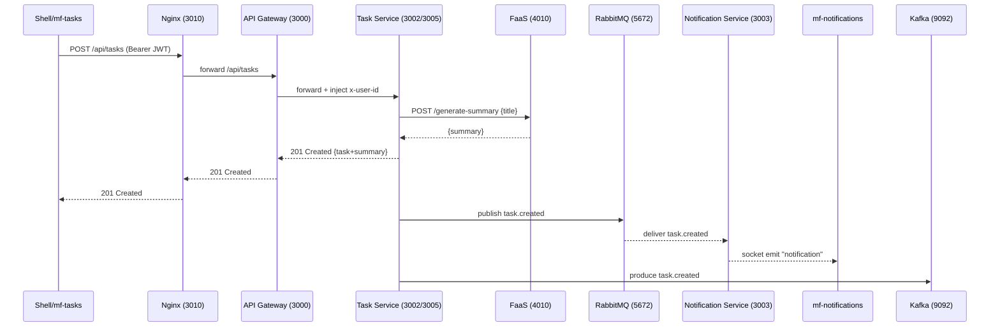

# Tutorial: Task Service (How It Works)

This tutorial explains **how the Task Service works in this project**, end‑to‑end, using only the components and flows that already exist in the repository.  The entry point, load balancers, services and message brokers involved are summarised below:

| Component | Port | Purpose |
| --- | --- | --- |
| **Nginx LB** | `:3010` | Front‑end entry point for API requests |
| **API Gateway** | `:3000` | Verifies JWTs, injects `x‑user‑id` header |
| **Task Service A** | `:3002` | One instance of the task backend |
| **Task Service B** | `:3005` | Second instance of the task backend |
| **FaaS Function** | `:4010` | Generates task summaries over HTTP |
| **RabbitMQ** | `:5672` | Publishes notifications for real‑time updates |
| **Kafka** | `:9092` | Produces events for streaming/analytics |
| **Notification Service** | `:3003` | Consumes RabbitMQ and pushes Socket.IO notifications to the UI |

---

## 1. What the Task Service does (in this project)

The **Task Service** is the backend component that handles **task creation** via REST and coordinates the **synchronous and asynchronous** actions around it.

### Synchronous responsibilities (request/response)

When a user creates a task through the UI:

1. The **Task Service** receives a `POST` request forwarded by the API Gateway.
2. It calls the **FaaS Function** (`POST /generate-summary`) to generate a **summary** for the task.
3. It returns the created task (including the generated summary) as the HTTP response.

### Asynchronous responsibilities (event‑driven)

After creating the task, the Task Service emits a `task.created` event on two messaging systems:

* **RabbitMQ** – so the Notification Service can send real‑time notifications to the UI.
* **Kafka** – so events exist on a stream topic for consumption (for example, by an Analytics Service).

---

## 2. How requests reach the Task Service

In this project, the client does **not** call the Task Service directly.  The normal request path is:

* **UI** → **Nginx** → `http://localhost:3010/api/...`
* **Nginx** → **API Gateway** → `:3000`
* **API Gateway** → **Task Service A/B** → `:3002` / `:3005`

### Why the API Gateway sits in front

The API Gateway is responsible for:

* **JWT verification** – rejecting requests with invalid or missing tokens.
* **Forwarding** requests to downstream services.
* **Injecting the authenticated identity** as a header (`x‑user‑id`).

This architecture allows the Task Service to focus on business logic without implementing token parsing/verification itself.

---

## 3. Load balancing & scaling (two Task Service instances)

The Task Service runs in **two instances** to demonstrate **scaling**:

* **Instance A**: listening on port `3002`.
* **Instance B**: listening on port `3005`.

Requests forwarded from the gateway may hit either instance, depending on routing or load‑balancing configuration.

### Starting the instances (existing commands)

```bash
# Instance A
cd task-service && npm start

# Instance B
cd task-service && PORT=3005 INSTANCE_ID=B npm start
```

The environment variables `PORT=3005` and `INSTANCE_ID=B` are used to run the second replica.

---

## 4. Task creation flow (the main story)

The important end‑to‑end flow when creating a task is outlined below:

1. **UI calls Nginx.**  The user (via `shell/mf‑tasks`) triggers:
   * `POST http://localhost:3010/api/tasks` with header `Authorization: Bearer <JWT>`.
2. **Nginx forwards to API Gateway.**  Nginx routes `/api/*` to the API Gateway (`:3000`).
3. **API Gateway verifies JWT.**  If the JWT is valid, the request continues; otherwise, it is rejected and never reaches the Task Service.
4. **Gateway forwards to Task Service and injects identity.**  The gateway forwards the request and adds a header `x‑user‑id: <user‑id>`.
5. **Task Service calls the FaaS function.**  It makes an HTTP call:
   * `POST http://localhost:4010/generate-summary` with a JSON body containing the task title.
   * The FaaS function returns `{ summary, at }`.
6. **Task Service returns HTTP 201 to the client.**  The response includes the created task and the generated summary.
7. **Task Service emits `task.created` asynchronously.**
   * **Publishes to RabbitMQ** for real‑time notifications.
   * **Produces to Kafka** for event streaming.
8. **Notification Service consumes RabbitMQ and pushes Socket.IO.**  It consumes the event and emits a Socket.IO notification so `mf-notifications` can display it.

---

## 5. Sequence diagram (Create task → FaaS → RabbitMQ/Kafka → Notifications)

Below is a Mermaid sequence diagram illustrating the interactions between components during task creation and notification dispatch.  Paste this into GitHub with Mermaid enabled to render it.



---

## 6. Integration details (exact components from this repo)

### 6.1 FaaS summary generation (HTTP)

The Task Service calls the function service at `http://localhost:4010/generate-summary` to generate a summary.  An example call is:

```bash
curl -i -X POST http://localhost:4010/generate-summary \ 
  -H "Content-Type: application/json" \ 
  -d '{"title":"My first FaaS task"}'
```

Expected behaviour:

* Returns a JSON response containing at least `summary` and `at`.
* Task creation stores/returns the summary alongside the task data.

### 6.2 RabbitMQ publishing (notifications path)

In this project, RabbitMQ is used as the message broker for notifications.  Things to look for:

* The queue **`task_events`** shows publish/deliver/ack activity when tasks are created.
* RabbitMQ management UI is available at `http://localhost:15672` (guest/guest).
* You can also check via API:

  ```bash
  curl -u guest:guest http://localhost:15672/api/queues/%2F
  curl -u guest:guest http://localhost:15672/api/connections
  ```

How it fits the flow:

* The Task Service publishes `task.created` to RabbitMQ.
* The Notification Service consumes from RabbitMQ and pushes Socket.IO notifications to the UI.

### 6.3 Kafka producing (streaming path)

Kafka is used for event streaming.  To inspect:

* The topic **`task-events`** contains JSON events like `task.created`.
* Use these commands to list and consume events (in Docker context):

  ```bash
  # List topics
  docker exec -it project-kafka-1 kafka-topics --bootstrap-server localhost:9092 --list

  # Consume events
  docker exec -it project-kafka-1 kafka-console-consumer \ 
    --bootstrap-server localhost:9092 \ 
    --topic task-events \ 
    --from-beginning \ 
    --timeout-ms 5000
  ```

How it fits the flow:

* The Task Service produces `task.created` to Kafka.
* Other consumers (like an Analytics Service) can consume from the topic.

---

## 7. Minimal run steps (only what exists in your README)

### 7.1 Infrastructure

Start RabbitMQ and Kafka via your compose setup.  The RabbitMQ UI is available at `http://localhost:15672` (credentials `guest/guest`).

### 7.2 Backend services

Start each of the backend services as follows:

* **Auth Service**

  ```bash
  cd auth-service && npm start
  ```

* **API Gateway**

  ```bash
  cd api-gateway && npm start
  ```

* **Task Service A**

  ```bash
  cd task-service && npm start
  ```

* **Task Service B**

  ```bash
  cd task-service && PORT=3005 INSTANCE_ID=B npm start
  ```

* **Notification Service**

  ```bash
  cd notification-service && npm start
  ```

* **FaaS Function**

  ```bash
  cd faas-function && npm start
  ```

### 7.3 Nginx

Run Nginx using your repository’s `nginx.conf` on port `3010`.  This will route `/api/*` to the API Gateway as described above.

---

## 8. How to verify the Task Service is working (quick checklist)

**A. Task creation triggers FaaS summary**

* Confirm `POST http://localhost:4010/generate-summary` returns `{ summary, at }`.
* Confirm task creation returns/stores a summary.

**B. Task creation triggers RabbitMQ notifications**

* Open the RabbitMQ UI and check the queue `task_events`.
* You should see publish/deliver/ack activity after creating tasks.

**C. Task creation triggers Kafka events**

* Consume from the `task-events` topic.
* You should see `task.created` JSON events after creating tasks.

---

By following the above steps and reviewing the sequence diagram, you can understand how the Task Service coordinates synchronous HTTP calls with asynchronous messaging to deliver both immediate responses and real‑time event notifications.
